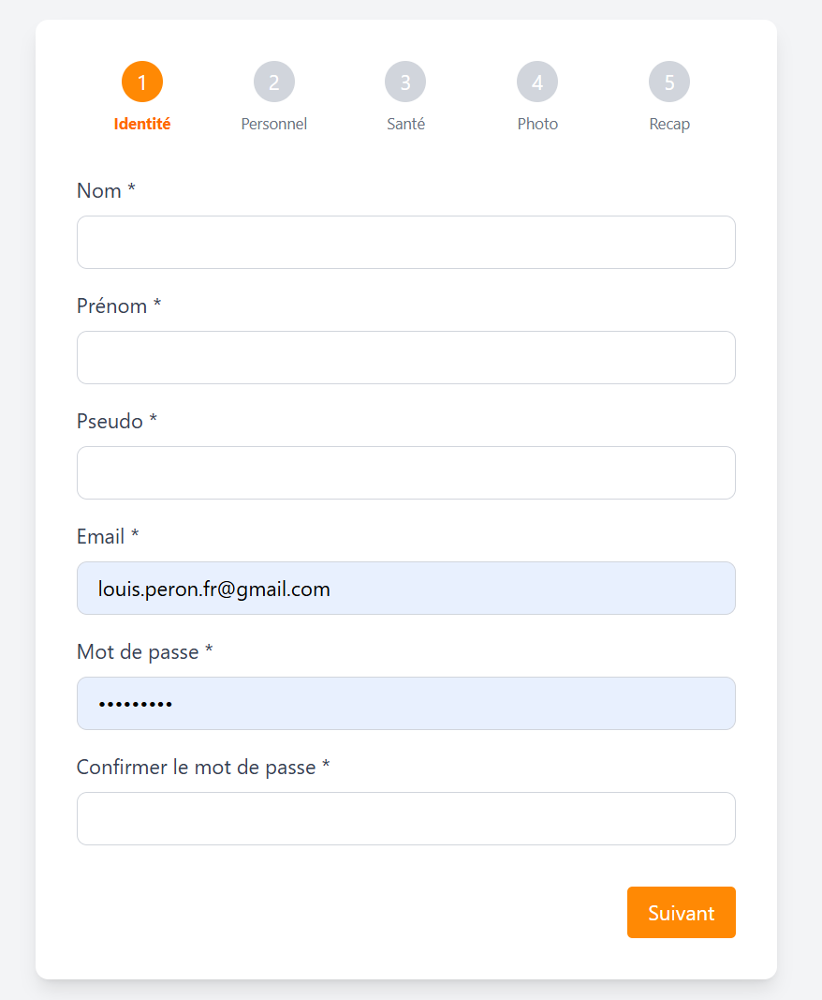
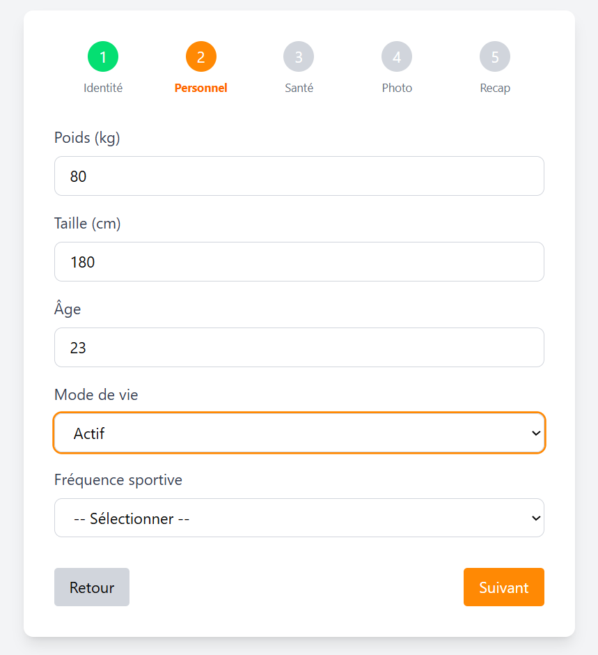
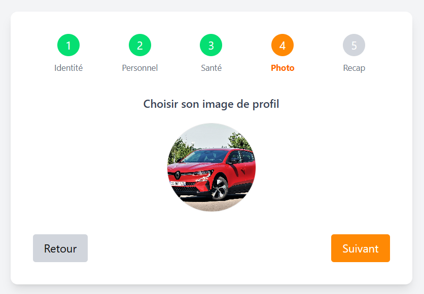
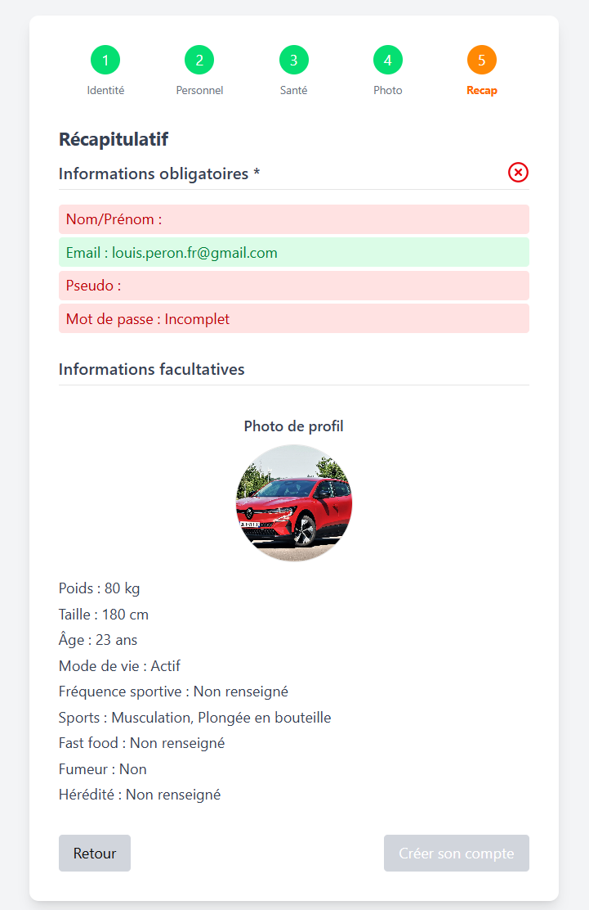
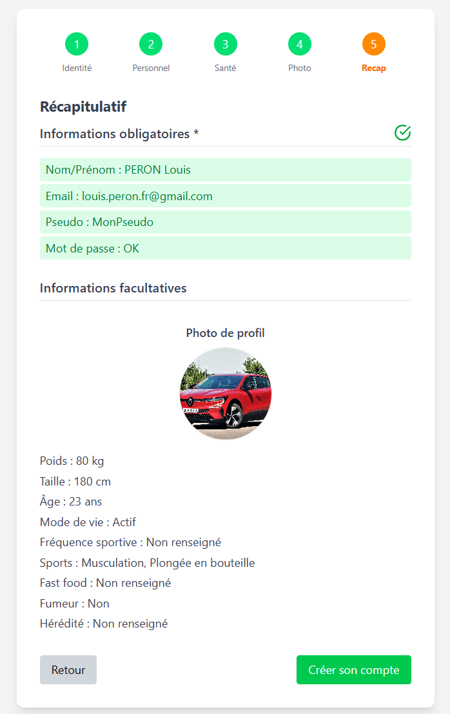
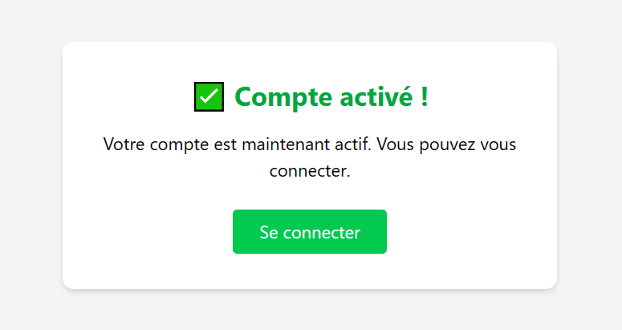
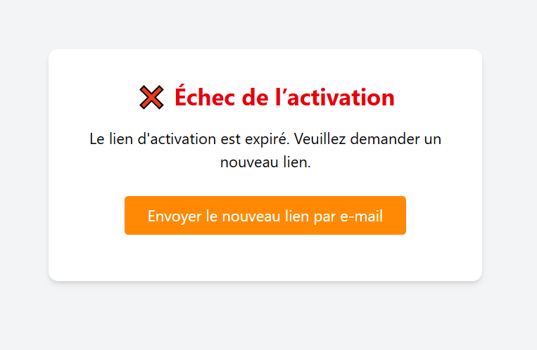
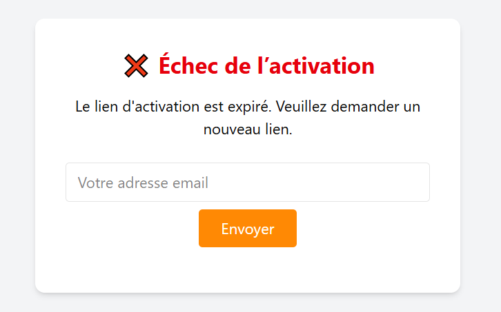
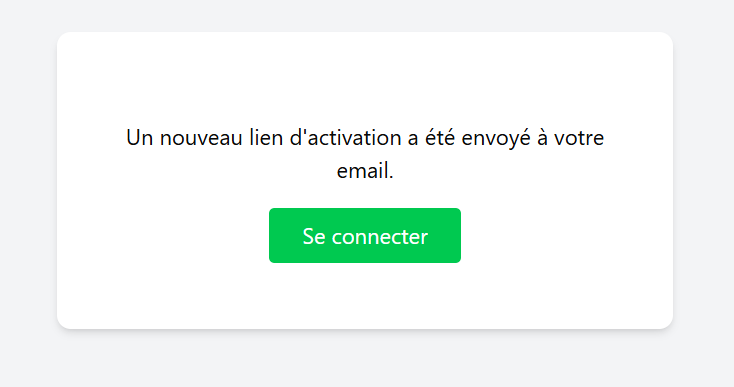

# Spécifications Fonctionnelles Détaillées (SFD)

## Projet : FoodTracker
**Version :** 1.0  
**Auteur(s) :** Louis PERON  
**Date :** 23/05/2025   

---

## Table des matières

1. [Introduction](#1-introduction)
2. [Description générale du système](#2-description-générale-du-système)
3. [Fonctionnalités détaillées](#3-fonctionnalités-détaillées)
4. [Règles de gestion transverses](#4-règles-de-gestion-transverses)
5. [Navbar, Header et menuing utilisateur (UI/UX)](#5-navbar-header-et-menuing-utilisateur)
6. [Glossaire](#6-glossaire)

---

## Features

1. [Creation de compte](#31-creation-de-compte)
2. [Authentification / Login](#31-creation-de-compte)
3. [Vitrine : Header](#31-creation-de-compte)
4. [Vitrine : Accueil](#31-creation-de-compte)
5. [Saas : Header](#31-creation-de-compte)
6. [Saas : Sidebar](#31-creation-de-compte)
7. [Saas : Mon Profil](#31-creation-de-compte)
1. [Saas : Paramètres](#31-creation-de-compte)
1. [Création de repas](#35-page-création-de-repas)
2. [Planning de repas](#36-page-planning-de-repas)
3. [Dashboard](#37-page-dashboard)
4. [Profil Utilisateur](#38-page-profil-utilisateur)
5. [Authentification](#39-page-authentification)

---

## 1. Introduction

- **Contexte :**  
  
  Suivi de la nutrition + macro tracking des nutriments sur une plage donnée.

- **Objectifs du document :**  
  
  Décrire le produit qui s'adresse à différents profils de personnes :
Sportifs, personnes voulant faire un régime ...

- **Portée fonctionnelle :**

  Toutes les features / écrans disponibles dans notre application.

---

## 2. Description générale du système

- **Vue d’ensemble fonctionnelle :**  
  
  La partie WEB / Mobile echange différents flux selon la ressource demandée avec les APIs en fonction des features.

- **Architecture fonctionnelle :** 

  

- **Environnements concernés :**
    - Web
    - Mobile (à voir)
    - API

---

## 3. Fonctionnalités détaillées

### 3.1 Création de compte 

## 3.1.1 Steps :

Pour la création d'un compte utilisateur, on doit passer par 5 étapes. 

La première étape est obligatoire, elle regroupe les informations d'identité permettant la création d'un compte utilisateur.

Les autres étapes sont falcultative. Elles peuvent ne pas être remplies.

**Etapes :**

1. Identité
2. Personnel
3. Santé
4. Photo

La dernière étape est une étape de récap. Elle permet de faire la synthèse de toutes les informations saisies par l'utilisateur.

5. Recap

Lors de cette dernière étape, si l'utilisateur a oublié de remplir des champs obligatoires, alors ces champs sont surlignés en rouge et le bouton "Créer son compte" est bloqué.

**Gestion d'erreurs :**

Si l'utilisateur a rempli tous les champs obligatoire, alors le bouton est en vert et est cliquable.

Une icone de croix rouge / check mark verte est présente dépendamment de l'état des champs obligatoire, si ils sont remplis dans la totalité ou non.

**STEPS EN IMAGE :**

**Cas d'erreur de l'étape Recap :**

**Cas de succès de l'étape Recap :**

## 3.1.2 Activation du compte :

Quand on créer son compte (quand on appuie sur le bouton *"Créer son compte"* à l'issue des étapes), le compte doit être activé. Cela permet de renforcer la sécurité. On obtient donc cette page :

**SUCCES :**

On clique sur le lien d'activation reçu par e-mail, le compte est bien activé :

**ECHEC : Cas nominal :**

Le lien d'activation a expiré (10 minutes).

**ECHEC : Cas compte déjà activé :**

### 3.1 Page Création de repas

- **🔰 Objectif :**  
  
  1. Consulter une banque d’aliments 
  2. Créer/modifier un aliment (nom, macros, portion)
  3. Composer des repas à partir d’aliments
  4. Sauvegarder des repas réutilisables

- **🔰 Pré-conditions :**
    - L'utilisateur doit être enregistré
- **🔰 Tests d'acceptance :**
- Je peux :
  - choisir si je veux ajouter un repas ou un aliment.
  - ajouter des aliments dans mon assiette
  - changer le nom de mon repas
  - enregistrer mon repas
  - ajouter un aliment
  - changer les valeurs nutritionnelles d'un aliment
  - changer le nom de mon aliment
  - utiliser mon aliment dans le mode Repas et l'ajouter dans mon assiette

- **🔰 Maquette d’écran :**  
  
- **🔰 Modification d'un aliment**

  **Workflow ➡️ [RG 001](#rg001), [RG 002](#rg002)**

  Lorsqu'on appui sur le bouton d'édition d'une des lignes de la colonne d'aliments (entouré d'un cercle bleu dans l'image ci-dessous),
alors une popup d'édition s'ouvre.

  

  On peut dans cette popup, modifier toutes les valeurs de l'aliment en question. Cela permet à l'utilisateur de gérer ses macros nutriments en fonction de ce qu'il peut consommer.

  

---

### 3.2 Page Planning de repas 

- **🔰 Objectif :**

  1. Calendrier hebdomadaire
  2. Assignation de repas à un jour / moment (petit-déjeuner, déjeuner, dîner)
  3. Modification a posteriori : portion, repas remplacé

- **🔰 Pré-conditions :**
  - L'utilisateur doit être enregistré

- **🔰 Tests d'acceptance :**

- **🔰 Maquettes d’écran :**  
  

---

### 3.3 Page Dashboard

- **🔰 Objectif :**

  - Vue sur :
  - La semaine (repas consommés)
  - Graphes de macros :
    - Protides
    - Glucides
    - Lipides
    - Calories
  - Poids (courbe dans le temps)
  - Objectif vs réel
  - Vue mois / année (filtrable)

- **🔰 Pré-conditions :**
  - L'utilisateur doit être enregistré

- **🔰 Tests d'acceptance :**

- **🔰 Maquettes d’écran :**  
  

---

### 3.4 Page Profil utilisateur

- **🔰 Objectif :**

  - Nom, email, sexe, âge, poids, taille, niveau activité
 
  - Objectif nutritionnel (maintien, perte, prise)
 
  - Objectifs macros personnalisés
 
  - Historique de poids

- **🔰 Pré-conditions :**
  - L'utilisateur doit être enregistré

- **🔰 Tests d'acceptance :**

- **🔰 Maquettes d’écran :**  
  

---

### 3.5 Page Authentification

- **🔰 Objectif :**

  - Login, inscription

  - Reset de mot de passe

  - Sécurité token / sessions

- **🔰 Pré-conditions :**
  - L'utilisateur doit être enregistré

- **🔰 Tests d'acceptance :**

- **🔰 Maquettes d’écran :**  
  

---

*(Répéter la section 3.1 pour chaque fonctionnalité)*

---

## 4. Règles de gestion transverses

📋 **Création de repas**

| Règle     | Objectif                                                                                                                                                                                                                                                                                                       | Ecran                                                             |
|-------------------------------|----------------------------------------------------------------------------------------------------------------------------------------------------------------------------------------------------------------------------------------------------------------------------------------------------------------|-------------------------------------------------------------------|
| **RG001** | **Bouton d'édition d'un aliment**   Cliquer sur le bouton d'édition d'un aliment représentant un encart de la liste des aliments permet d'ouvrir la popup ([RG002](#rg002)) d'édition des métriques d'un aliment.                                                                                          |  |
| **RG002** | **Popup d'édition des métriques d'un aliment**   La popup d'édition des métriques d'un aliment permet de modifier toutes les valeurs nutritives de cet aliment. Cela permet à l'utilisateur d'avoir une gestion beaucoup plus fine sur sa consommation en glucides, calories, proteines, vitamines etc ... |         |

---

## 5. Navbar, Header et menuing utilisateur

- **Principes de navigation :**  
  [Ex : menu fixe, navigation par onglet…]

- **Wireframes :**  
  

---

## 6. Glossaire

| Terme          | Définition                                    |
|----------------|-----------------------------------------------|
| API            | Interface de Programmation d’Application      |
|            |  |

---

